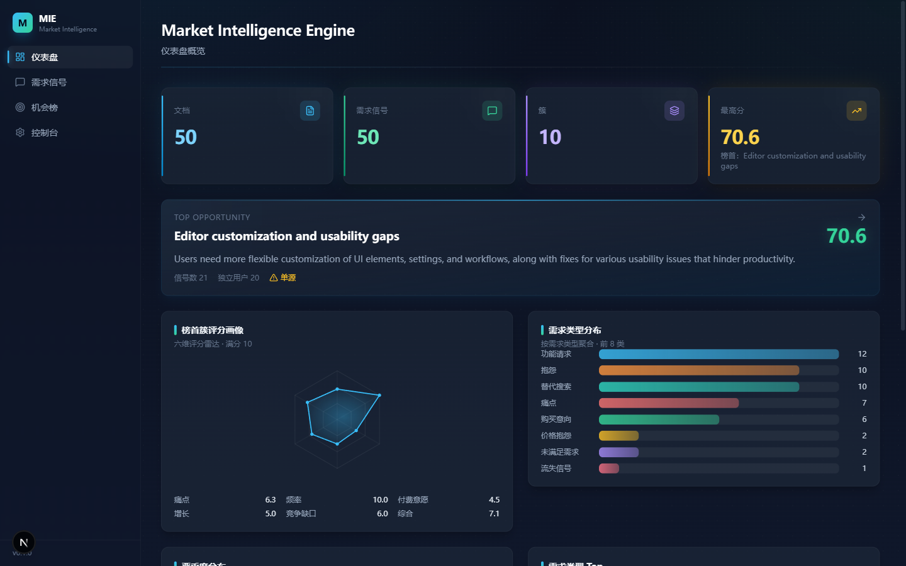

# Market Intelligence Engine

> Market Intelligence Engine = 一个持续监听互联网用户行为与表达、自动提取市场痛点、聚合需求、识别趋势并生成产品机会的 Evidence-driven Product Discovery System。



---

## 架构

```
                         ┌─────────────────────┐
                         │      Data Sources    │
                         │ Reddit / GitHub ...  │
                         └──────────┬──────────┘
                                    │
                                    ↓
                         ┌─────────────────────┐
                         │   Source Adapters    │
                         └──────────┬──────────┘
                                    │
                                    ↓
                         ┌─────────────────────┐
                         │  Crawling Scheduler  │
                         └──────────┬──────────┘
                                    │
                                    ↓
                         ┌─────────────────────┐
                         │ Crawlee / Playwright │
                         └──────────┬──────────┘
                                    │
                                    ↓
                         ┌─────────────────────┐
                         │    Raw Data Layer    │
                         └──────────┬──────────┘
                                    │
                                    ↓
                         ┌─────────────────────┐
                         │  Clean & Normalize   │
                         └──────────┬──────────┘
                                    │
                                    ↓
                         ┌─────────────────────┐
                         │    Deduplication     │
                         └──────────┬──────────┘
                                    │
                                    ↓
                         ┌─────────────────────┐
                         │  Content Classifier  │
                         └──────────┬──────────┘
                                    │
                                    ↓
                         ┌─────────────────────┐
                         │  Demand Extraction   │
                         └──────────┬──────────┘
                                    │
                                    ↓
                         ┌─────────────────────┐
                         │  Embedding / Cluster │
                         └──────────┬──────────┘
                                    │
                                    ↓
                         ┌─────────────────────┐
                         │    Demand Scoring    │
                         └──────────┬──────────┘
                                    │
                                    ↓
                         ┌─────────────────────┐
                         │  Opportunity Engine  │
                         └──────────┬──────────┘
                                    │
                                    ↓
                         ┌─────────────────────┐
                         │  Dashboard / Reports │
                         └─────────────────────┘
```

## 目录结构

```
Market_Intelligence_Engine/
├── backend/                # FastAPI 后端 (Python)
│   ├── app/
│   │   ├── main.py         # 应用入口与路由挂载
│   │   ├── config/         # 配置管理
│   │   ├── models/         # SQLAlchemy ORM 模型（10 张核心表）
│   │   ├── schemas.py      # Pydantic 请求/响应模型
│   │   ├── api/routes/     # REST API 路由
│   │   ├── adapters/       # 数据源适配器 (base + reddit)
│   │   ├── crawling/       # 爬取调度与工作器
│   │   ├── extraction/     # 内容清洗、解析、标准化
│   │   └── intelligence/   # 分类、抽取、Embedding、聚类、评分
│   └── prompts/            # LLM Prompt 模板
│
├── frontend/               # Next.js 前端 (TypeScript)
│   └── src/                # 页面与组件 (Dashboard/Demands/Opportunities)
│
├── docker/                 # Docker 构建文件
│   ├── backend.Dockerfile
│   ├── frontend.Dockerfile
│   ├── init-pgvector.sh
│   └── README.md
│
├── migrations/             # 数据库迁移
├── tests/                  # 测试
├── scripts/                # 工具脚本
│
├── docker-compose.yml      # 基础设施 (PostgreSQL + Redis)
├── .env.example            # 环境变量模板
└── README.md               # 本文件
```

## 快速开始

### 1. 启动基础设施

```bash
docker compose up -d
```

启动 PostgreSQL (pgvector) + Redis，端口分别为 `5432` 和 `6379`。

### 2. 配置环境变量

```bash
cp .env.example .env
# 编辑 .env 填入 LLM_BASE_URL / LLM_API_KEY / LLM_MODEL 等配置
```

### Embedding 环境变量（Windows 用户级，永久生效）

本地 embedding 模型（all-MiniLM-L6-v2）通过 HuggingFace 生态加载，涉及三个环境变量。
**推荐用 PowerShell 设为用户级永久变量**（`[Environment]::SetEnvironmentVariable(名, 值, "User")`），
设置后需重开终端生效：

| 变量 | 推荐值 | 作用 |
|---|---|---|
| `HF_HOME` | `D:\hf_cache` | 模型缓存目录（默认在 C 盘用户目录，可挪到数据盘） |
| `HF_ENDPOINT` | `https://hf-mirror.com` | 国内镜像站；若网络可直连官方可省略 |

**本地优先策略（代码保证，无需 OFFLINE 变量）**：`embedder.py` 的 `get_model()`
先用 `local_files_only=True` 纯本地加载（零网络请求、秒级）；仅当本地无缓存时
才回退到联网下载。首次下载约 90MB：国内直连官方站通常被墙；镜像站在部分网络下
不稳定；备选方案是用 ModelScope 下载后从本地路径加载。

> 历史方案备注：曾推荐设置 `HF_HUB_OFFLINE=1` 强制离线。该变量会拦截一切 HF 网络
> 请求，与"缓存缺失时自动下载"的兜底逻辑冲突，已被上述代码级 local-first 取代。
> 若你设置过它，建议移除：`[Environment]::SetEnvironmentVariable("HF_HUB_OFFLINE", $null, "User")`

### 3. 启动后端

```bash
cd backend
cp ../.env.example .env   # 或创建 backend 专用 .env
uv sync
uvicorn app.main:app --reload --host 0.0.0.0 --port 8000
```

后端 API 文档: `http://localhost:8000/docs`

### 4. 启动前端

```bash
cd frontend
npm install
npm run dev
```

前端页面: `http://localhost:3000`

## API 端点 (MVP)

| 方法 | 端点 | 说明 |
|---|---|---|
| GET | `/sources` | 获取数据源列表 |
| POST | `/sources` | 创建数据源 |
| GET | `/documents` | 获取文档列表 |
| GET | `/documents/{id}` | 获取文档详情 |
| GET | `/demands` | 获取需求信号列表 |
| GET | `/demands/{id}` | 获取需求信号详情 |
| GET | `/clusters` | 获取需求聚类列表 |
| GET | `/clusters/{id}` | 获取需求聚类详情 |
| GET | `/opportunities` | 获取产品机会列表（嵌套可行性分析） |
| GET | `/opportunities/{id}` | 获取产品机会详情 |
| POST | `/opportunities/{id}/analyze` | 生成/覆盖机会可行性分析（LLM，中文输出） |
| GET | `/trends` | 获取趋势数据 |
| POST | `/crawl/jobs` | 创建爬取任务 |
| GET | `/crawl/jobs/{id}` | 获取爬取任务状态 |

## 开发路线

| Phase | 名称 | 目标 |
|---|---|---|
| 0 | 基础设施 | PostgreSQL, Redis, FastAPI, Crawlee, Docker |
| 1 | 第一个数据源 | Reddit 适配器 — 发现 → 抓取 → 解析 → 存储 |
| 2 | 需求识别 | LLM Classification — 需求类型、痛点、用户、场景 |
| 3 | Embedding | pgvector — 相似需求搜索 |
| 4 | Cluster | 需求聚类 — 10000 posts → 500 signals → 50 clusters |
| 5 | Scoring | 需求评分模型 |
| 6 | Dashboard | Demand Feed, Explorer, Opportunity Ranking, Trend, Evidence |
| 7 | 扩展数据源 | GitHub → V2EX → Hacker News → Product Hunt → App Store |

## 技术栈

- **后端**: Python 3.12, FastAPI, SQLAlchemy, Pydantic, Crawlee, Playwright
- **数据库**: PostgreSQL 16 (pgvector), Redis 7
- **前端**: Next.js, TypeScript, Tailwind CSS
- **AI**: LLM API (需求分类与抽取)
- **调度**: APScheduler + Redis → Celery/ARQ

## 项目原则

1. **Evidence First** — 证据优先，每个需求结论必须可追溯到原始证据
2. **User Behavior > User Opinion** — 真实行为优于主观意愿
3. **Demand > Feature** — 优先识别问题和任务，而非功能愿望
4. **Human in the Loop** — AI 做发现和整理，人做最终判断
5. **Decision Support, not Decision Maker**

## License

Private — Internal use only.
